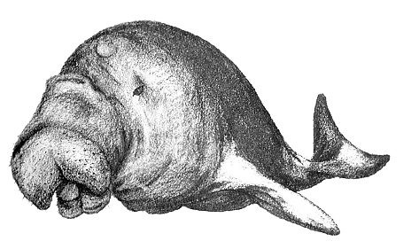
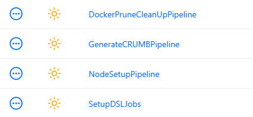
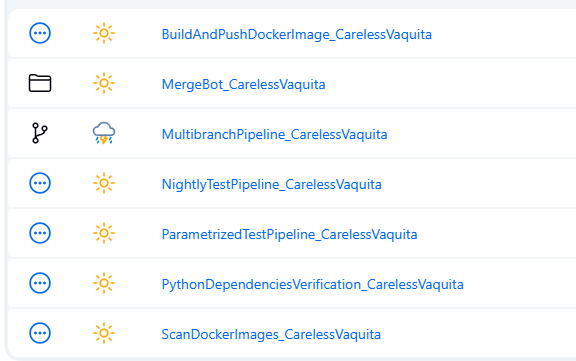

<h2>What is <i>ResponsibleDugong</i></h2>  
Responsible Dugong is an <i>open source setup of Jenkins instance preconfigured as a code.</i> This project is closely correlated to: [CarelessVaquita](https://github.com/mcieciora/CarelessVaquita)

Currently supported versions of the services:
-  Jenkins 2.500 with plugins (versioned as 0.5.1):
    - configuration-as-code
    - role-strategy
    - blueocean 
    - docker-plugin 
    - docker-workflow 
    - rebuild 
    - parameterized-scheduler 
    - job-dsl 
    - ws-cleanup 
    - pipeline-graph-view 
    - pipeline-stage-view 
    - prometheus
- Vinkunja 0.24.6
- MariaDB 11.7.2
- Grafana 11.5.2
- Registry 2.8
- Portainer-ce 2.27.1
- Prometheus 3.2.1

Currently supported versions of the tools:
- Docker 27.3.1
- Docker Compose 2.31.0
- jq 1.7.1
- hadolint v2.12.0-alpine
- shellcheck v0.10.0
- trivy 0.59.0
- docker scout 1.16.3
- dive v0.12

<h2>About Dugong</h2>  
Dugong <i>(Dugong dugon)</i>  is a large, grey brown bulbous animal with a flattened fluked tail, like that of a whale, no dorsal fin, paddle like flippers and distinctive head shape. 
With its long lifespan of 70 years or more and slow rate of reproduction, the dugong is especially vulnerable to extinction.
The dugong has been hunted for thousands of years for its meat and oil. Traditional hunting still has great cultural significance in several countries in its modern range, particularly northern Australia and the Pacific Islands. 
Current Dugong population size is not fully known.
This animal was chosen as mascot for this project to raise awareness, that there are groups of people who, despite the real threat of extinction of an animal species, still put traditions and habits from hundreds and sometimes even thousands of years ago above the good of the environment.



<i>source:</i> [Dugong - Wikipedia](https://en.wikipedia.org/wiki/Dugong)

<h2>Introduction</h2>

CarelessVaquita's main pipeline uses git checkout stage and tag creation commands. 
The purpose of using and establishing an SSH connection (instead of cloning, fetching or committing and tagging via HTTPS) is to encrypt data exchanged between the client and the server. 
SSH keys are more secure than any password or authentication token, making them almost impossible to crack. 
It is highly advised to create SSH keys on daily basis, but most importantly follow steps below to set up SSH keys authentication on Jenkins server.


<h2>How to setup</h2>

<h3>Base Jenkins setup job</h3>
After logging into your Jenkins instance there should be a job called "GenerateCRUMBPipeline" ready to trigger. Start it with "Build" button. The purpose of this job is to generate API token to do all administrative work from Jenkins pipelines. Learn more about CRUMB and tokens here: https://www.jenkins.io/doc/book/security/csrf-protection/. When build is finished, get token from logs and save it for later. \
After that open "NodeSetupPipeline" job and trigger it with default "build-in" value set. Provide generated token and follow instructions of the build. The main goal of this pipeline is to set up pair of SSH keys, which are available in ssh_keys directory in your local Jenkins volume. \
Pipeline will ask you to:
- copy printed key and add it to your GitHub account. \
- copy two keys from .jenkins_volume/ssh_keys to .ssh_keys \
- run git sync command on the agent

To add any other node just create it via UI in Jenkins, then set it online and repeat the instruction. Instead of .ssh_keys you will copy keys to physical file system.



<h3>Step-by-step instruction</h3>

<h4>Preconditions</h4>
You need to have access to server where dockerized jenkins is running and have administrator privileges in Jenkins instance itself.


- On dockerized jenkins host open jenkins container shell
```
docker exec -it jenkins sh
```

- Generate a pair of ssh keys (Hit enter/return through all additional prompts)
```
ssh-keygen -t ed25519
```

- Copy content of id_ed25519 and id_ed25519.pub by running _cat_ command.
```
cat id_ed25519
cat id_ed25519.pub
```

- Go to GitHub and open repository page
- Go to repository settings and open "Deploy keys" tab and click "Add deploy key" button. Configure as follows:
```
Title: <any> or jenkins_server
Key: <content of id_ed25519.pub>
Tick "Allow write access"
```

- Next go to your Jenkins instance and open Manage Jenkins > Credentials > System > Global credentials and click "Add credentials" button. Configure as follows:
```
Kind: "SSH Username and private key"
Scope: "Global"
ID: github_id
Description: <any> or <blank>
Username: <any> or jenkins_server
```
- Tick "Private Key / Enter Directly", click "Add", paste content of id_ed25519 and click "Create"

- Go back to jenkins container shell and run:
```
git ls-remote -h -- <your repository SSH url> HEAD
```

You should be able now to run your custom pipelines or the ones generated by SetupDSLJob.

<h3>SetupDSLJob</h3>

After logging into your Jenkins instance there should be a job called "SetupDSLJobs" ready to trigger. Build SetupDSLJobs with parameters, put your project name, GitHub url, and it will generate four base pipelines and one view that contains all of them in one place.




<b>NOTE:</b> It is not mandatory to run SetupDSLJobs on project, that is forked CarelessVaquita project. It is not even required to have the same files structure, but the only directory that <b>must</b> exist is <i>jobs</i>, where pipelines declaration should be defined.

If you are using CarelessVaquita as template project, remember about setting _user.email_ and _user.name_ with git config --global command inside Jenkins instance.

Happy Dugonging ;)  

<i>mcieciora</i>
